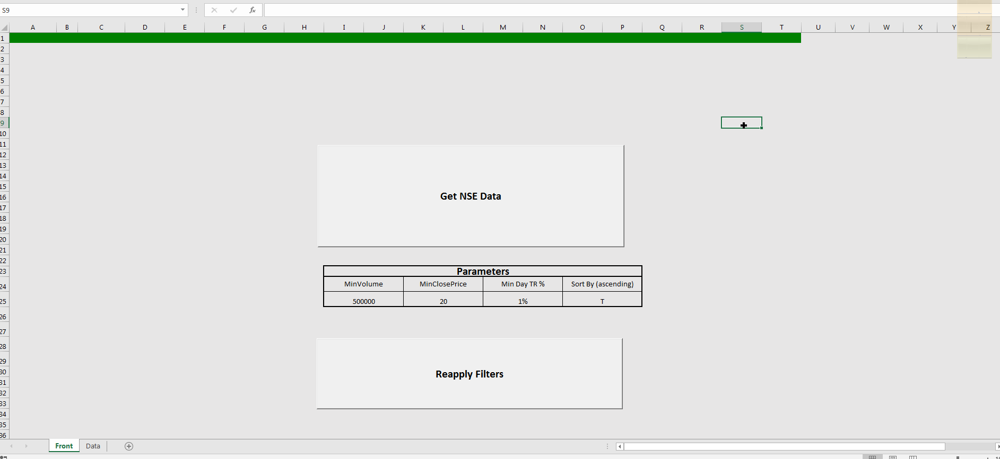
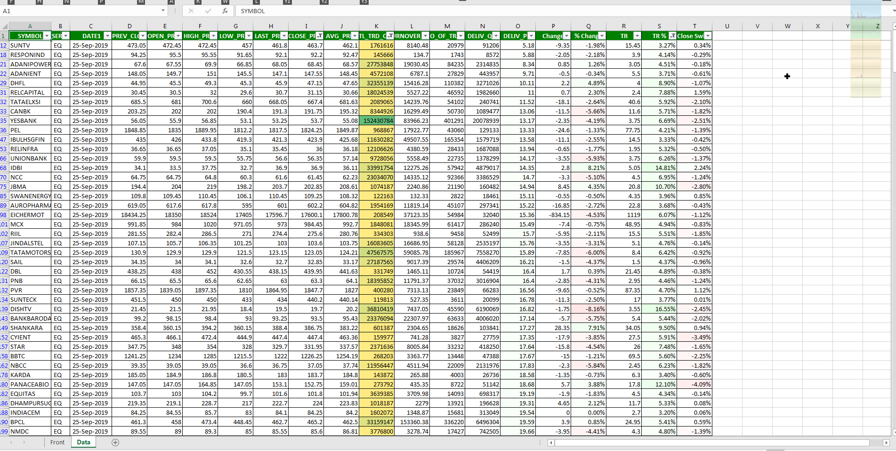

# Excel Tools for Indian Stock Markets
  
## Requirements  
Excel 2016 PRO  
  
## Table of Contents  
---
### 1.  TradeActivityNSE  
#### Description
Gets Last Day BHavcopy NSE and tries to find out what shares were traded most ( Proportion of delivery is comparitively lesser) 
* Calculates 
    * Day Change, 
    * Day Chnage Percentage
    * True range of Share  ( Day High - Day Low)
    * Truie Range % (Wrt Pre Day Closing Price)
    * Closing Movement from Average Traded Price
* Filters Data based on 
    * Minimum 100K traded QTY
        * Stocks with some minimum liquidity
    * True Range % greater than 1%
        * If True Range is too low, It is unsuitable for trading
    * Closing price is Greater than 25
        * Logic : Lower Stock price is greater slippage chnace
* Sorts Data  Based On
    * Delivery Percentage ( Ascending)
        * The top most records are the most traded an least Delivery taken on them
  
### Screenshot  

  

---